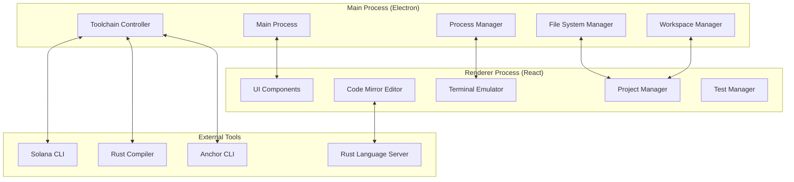

# Design Document

## Overview

The SIMULSOL Core transforms the existing Electron application into a comprehensive Solana development environment. The design leverages the current Electron + React + TypeScript stack and extends it with IDE-specific components, Solana toolchain integration, and advanced code editing capabilities. The architecture follows a modular approach with clear separation between the main process (Electron backend), renderer process (React frontend), and external tool integrations.

## Architecture

### High-Level Architecture



### Process Communication

The design uses Electron's IPC (Inter-Process Communication) to handle communication between the main process and renderer process:

- **Main Process**: Handles file system operations, external process management, and system integration
- **Renderer Process**: Manages the UI, code editing, and user interactions
- **IPC Channels**: Secure communication channels for data exchange and command execution

## Components and Interfaces

### 1. Main Process Components

#### File System Manager
```typescript
interface FileSystemManager {
  createProject(template: ProjectTemplate, path: string): Promise<ProjectStructure>
  readFile(path: string): Promise<string>
  writeFile(path: string, content: string): Promise<void>
  watchFiles(patterns: string[]): FileWatcher
  getProjectStructure(rootPath: string): Promise<ProjectStructure>
}
```

#### Process Manager
```typescript
interface ProcessManager {
  executeCommand(command: string, args: string[], cwd: string): Promise<ProcessResult>
  startTerminal(cwd: string): TerminalSession
  killProcess(pid: number): Promise<void>
  getRunningProcesses(): ProcessInfo[]
}
```

#### Workspace Manager
```typescript
interface WorkspaceManager {
  saveWorkspace(workspace: WorkspaceState): Promise<void>
  loadWorkspace(path: string): Promise<WorkspaceState>
  getRecentWorkspaces(): WorkspaceInfo[]
  setActiveProject(projectPath: string): Promise<void>
}
```

#### Toolchain Controller
```typescript
interface ToolchainController {
  detectSolanaInstallation(): Promise<SolanaInstallation>
  compileProgram(projectPath: string, options: CompileOptions): Promise<CompileResult>
  runTests(projectPath: string, testOptions: TestOptions): Promise<TestResult>
  deployProgram(programPath: string, network: string): Promise<DeployResult>
}
```

### 2. Renderer Process Components

#### IDE Layout Manager
```typescript
interface IDELayoutManager {
  initializeLayout(): void
  addPanel(panel: PanelConfig): void
  removePanel(panelId: string): void
  resizePanel(panelId: string, size: PanelSize): void
  saveLayout(): LayoutState
  restoreLayout(layout: LayoutState): void
}
```

#### Code Editor Component
```typescript
interface CodeEditor {
  loadFile(filePath: string): Promise<void>
  saveFile(): Promise<void>
  getContent(): string
  setContent(content: string): void
  addLanguageSupport(language: LanguageSupport): void
  showDiagnostics(diagnostics: Diagnostic[]): void
  goToDefinition(position: Position): Promise<void>
}
```

#### Project Explorer Component
```typescript
interface ProjectExplorer {
  loadProject(projectPath: string): Promise<void>
  refreshProject(): Promise<void>
  createFile(path: string, type: FileType): Promise<void>
  deleteFile(path: string): Promise<void>
  renameFile(oldPath: string, newPath: string): Promise<void>
  getSelectedFiles(): string[]
}
```

#### Terminal Component
```typescript
interface TerminalComponent {
  createTerminal(config: TerminalConfig): TerminalInstance
  executeCommand(command: string): Promise<void>
  sendInput(input: string): void
  clear(): void
  resize(cols: number, rows: number): void
  onOutput(callback: (data: string) => void): void
}
```

### 3. Integration Interfaces

#### Language Server Protocol Integration
```typescript
interface LSPClient {
  initialize(rootPath: string): Promise<void>
  textDocumentDidOpen(document: TextDocument): void
  textDocumentDidChange(document: TextDocument, changes: TextDocumentChange[]): void
  requestCompletion(position: Position): Promise<CompletionItem[]>
  requestHover(position: Position): Promise<Hover>
  requestDiagnostics(): Promise<Diagnostic[]>
}
```

#### Solana Toolchain Integration
```typescript
interface SolanaToolchain {
  validateInstallation(): Promise<ValidationResult>
  createProject(template: SolanaProjectTemplate): Promise<ProjectStructure>
  buildProgram(config: BuildConfig): Promise<BuildResult>
  testProgram(config: TestConfig): Promise<TestResult>
  deployProgram(config: DeployConfig): Promise<DeployResult>
}
```

## Data Models

### Project Structure
```typescript
interface ProjectStructure {
  name: string
  path: string
  type: 'anchor' | 'native' | 'token'
  files: FileNode[]
  configuration: ProjectConfiguration
  dependencies: Dependency[]
}

interface FileNode {
  name: string
  path: string
  type: 'file' | 'directory'
  children?: FileNode[]
  metadata: FileMetadata
}
```

### Workspace State
```typescript
interface WorkspaceState {
  activeProject: string
  openFiles: OpenFile[]
  layout: LayoutState
  terminalSessions: TerminalSession[]
  preferences: UserPreferences
  recentProjects: string[]
}

interface OpenFile {
  path: string
  content: string
  isDirty: boolean
  cursorPosition: Position
  scrollPosition: number
}
```

### Build and Test Results
```typescript
interface BuildResult {
  success: boolean
  artifacts: BuildArtifact[]
  errors: CompileError[]
  warnings: CompileWarning[]
  duration: number
}

interface TestResult {
  success: boolean
  tests: TestCase[]
  coverage?: CoverageReport
  duration: number
}
```

## Error Handling

### Error Categories
1. **File System Errors**: Handle file access, permission, and I/O errors
2. **Compilation Errors**: Parse and display Rust/Solana compilation errors
3. **Runtime Errors**: Handle process execution and toolchain errors
4. **Network Errors**: Handle deployment and RPC connection errors
5. **Configuration Errors**: Validate and report configuration issues

### Error Handling Strategy
```typescript
interface ErrorHandler {
  handleFileSystemError(error: FileSystemError): UserFriendlyError
  handleCompilationError(error: CompilationError): DiagnosticError
  handleRuntimeError(error: RuntimeError): ActionableError
  handleNetworkError(error: NetworkError): RetryableError
}

interface UserFriendlyError {
  message: string
  details: string
  suggestedActions: Action[]
  severity: 'error' | 'warning' | 'info'
}
```

### Recovery Mechanisms
- **Auto-save**: Automatically save work every 30 seconds
- **Session Recovery**: Restore workspace state after crashes
- **Graceful Degradation**: Continue operation with reduced functionality when tools are unavailable
- **Retry Logic**: Automatic retry for transient failures with exponential backoff

## Testing Strategy

### Unit Testing
- **Component Testing**: Test individual React components with Jest and React Testing Library
- **Service Testing**: Test main process services with Jest and mock file system operations
- **Integration Testing**: Test IPC communication between main and renderer processes

### End-to-End Testing
- **User Workflow Testing**: Test complete user workflows using Playwright or similar
- **Cross-Platform Testing**: Ensure functionality works on Windows, macOS, and Linux
- **Performance Testing**: Measure startup time, file loading, and compilation performance

### Test Structure
```typescript
// Component Tests
describe('CodeEditor', () => {
  it('should load and display file content', async () => {
    // Test implementation
  })
  
  it('should highlight Solana-specific syntax', () => {
    // Test implementation
  })
})

// Integration Tests
describe('Project Management', () => {
  it('should create new Anchor project with correct structure', async () => {
    // Test implementation
  })
  
  it('should compile project and display results', async () => {
    // Test implementation
  })
})
```

### Testing Tools and Frameworks
- **Jest**: Unit testing framework
- **React Testing Library**: Component testing utilities
- **Playwright**: End-to-end testing
- **Mock Service Worker**: API mocking for tests
- **Electron Testing**: Spectron or similar for Electron-specific testing

## Performance Considerations

### Optimization Strategies
1. **Lazy Loading**: Load components and features on demand
2. **Virtual Scrolling**: Handle large file lists and terminal output efficiently
3. **Debounced Operations**: Debounce file watching and auto-save operations
4. **Worker Threads**: Use web workers for CPU-intensive operations
5. **Caching**: Cache compilation results and language server responses

### Memory Management
- **File Content Caching**: Implement LRU cache for file contents
- **Process Cleanup**: Properly terminate child processes and clean up resources
- **Event Listener Management**: Remove event listeners to prevent memory leaks

### Startup Performance
- **Progressive Loading**: Load core features first, then additional tools
- **Background Initialization**: Initialize non-critical services in the background
- **Preload Optimization**: Minimize preload script size and complexity